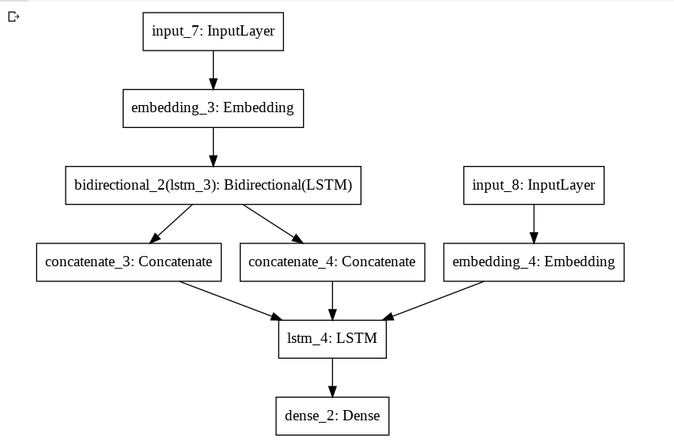
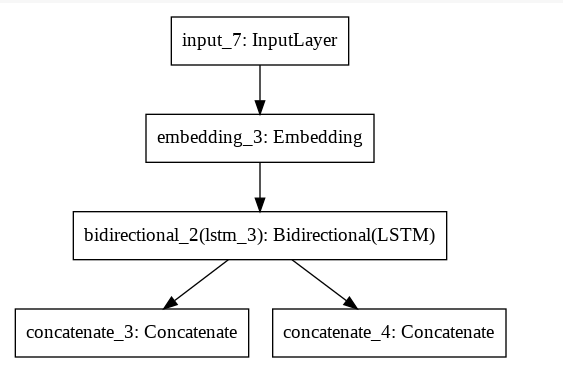
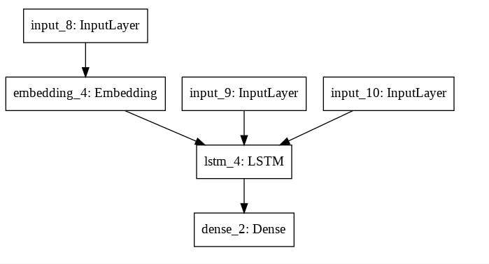

# Language-Translation using Bi-Directional LSTM

Read more at https://medium.com/@SpielmitDaten/machine-translation-using-seq2seq-model-aedcc03f967b 
Here I am using seq2seq Neural network.

Steps:
Download the dataset for english and french text.
Converted data into dataframe.
Tokenized the sentence to full length as we are not having large dataset.
Padded the sentence to the maximum sentence length available for respective languages.
Used Encoder and Decoder to translate.

<b>Encoder:</b> Encoder help in training the dataset in english and can later the output from the last layer i.e <b>CellState</b> and the <b>output(H)</b> to the decode the data

<b>Decoder:</b> Decoder will take the output from the encoder and will use it to decode and again it'll give an output in 3x3

Here in this we usign multiple LSTM layers.

here we used bi-birectional LSTM for encoding

<h3> Inference </h3>

and for inference we are making another model using the outputs and cell stated from the previous models
  
<b>here we are having the encoder model</b>
 
 

  
<b>Here we are having the decoder model which will predict the output </b>

 
What we are gonna do is simply:
we took one encoder layer and gave them the states and weights from the previous layer so it'll be like already trained layer.
and from <b> encoder layer we'll predict the cell states (h and c) </b>

and will pass this h & c and tokenized french words to the decoder layer to predict 

again decoder layer will predict the cell state and decoder output which will contain the tokenized matrix
From the matrix we'll reverse_tokenize the senetence and Will get the predicted output

And from the above layer we'll take the output from the encoder 
